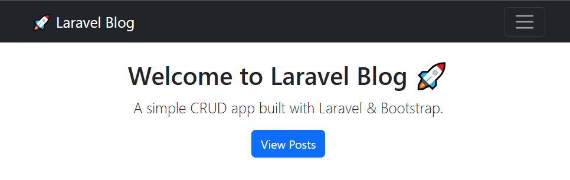
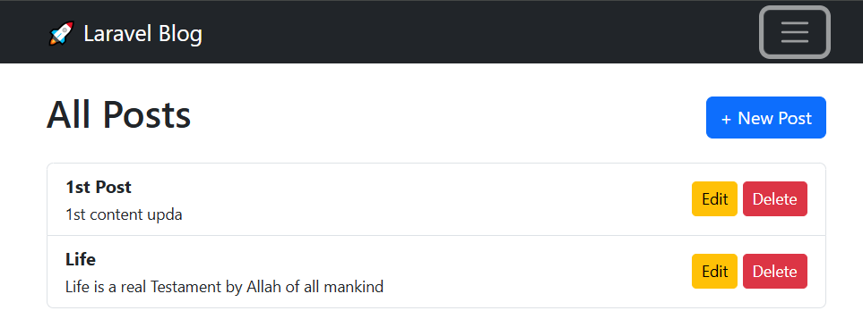
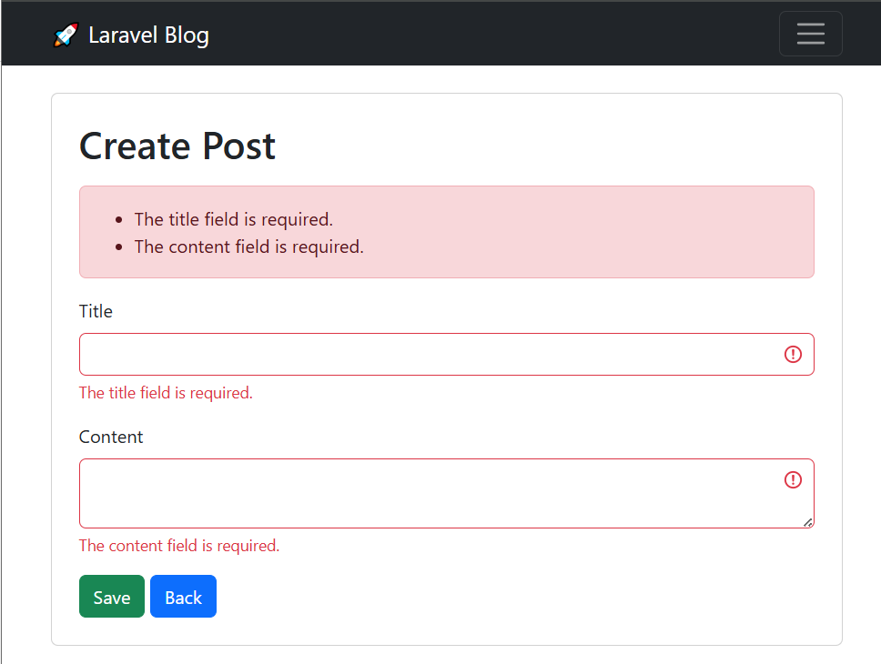
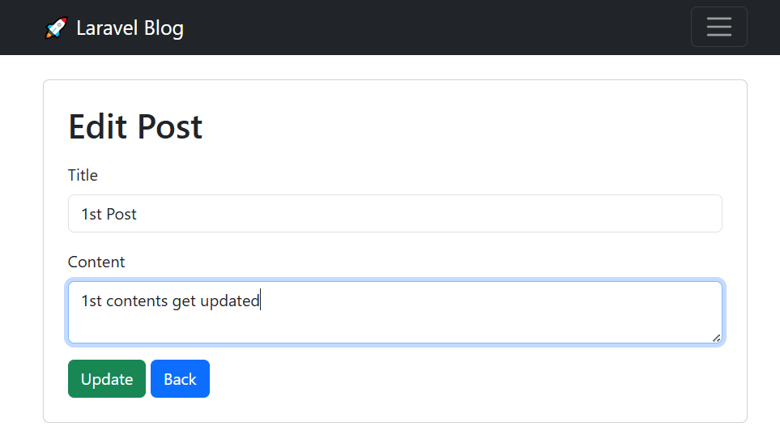
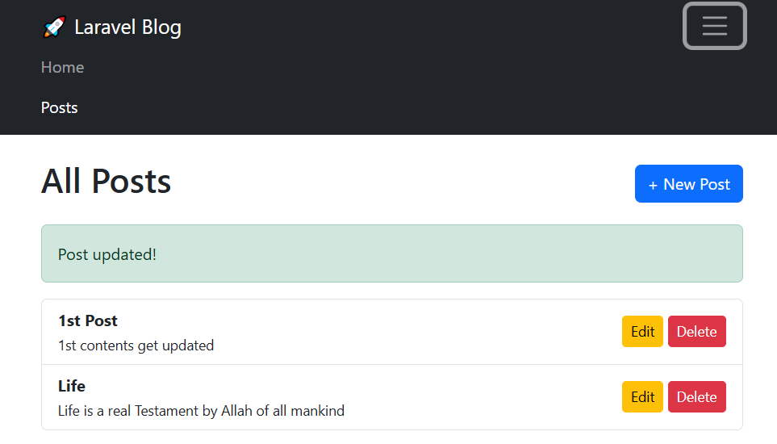

# Laravel CRUD (blog)

A simple "Laravel mini application" demonstrating "CRUD (Create, Read, Update, Delete)" operations for a blog system.  
This project is intended for practicing Laravel basics.

---

# Features
- Create new blog posts  
- View all posts  
- Edit existing posts  
- Delete posts  
- Basic Bootstrap-based UI  

---

# Requirements
- PHP >= 8.2.12  
- Composer  
- Laravel 12.x  
- MySQL or SQLite database  

---

# Installation

1. Clone the repository:
   git clone https://github.com/adnanafzalraj/laravel-crud.git
   cd laravel-blog-crud

2. Install dependencies:
   composer install

3. Copy .env.example to .env:
   cp .env.example .env

4. Set up your database in the .env file, then run migrations:
   php artisan migrate

5. Start the development server:
   php artisan serve

6. Visit the app in your browser:
   http://127.0.0.1:8000

---

## 📸 Screenshots

---

## 📂 Project Structure
- app/Models/Post.php → Post model  
- app/Http/Controllers/PostController.php → Handles CRUD logic  
- resources/views/posts/ → Blade views for posts  
- routes/web.php → Routes definition  

---

## 🧑‍💻 Author
- Your Name : Rana Adnan Afzal 
- GitHub: https://github.com/adnanafzalraj 

---

## 📜 License
This project is open-source and available under the MIT License.
